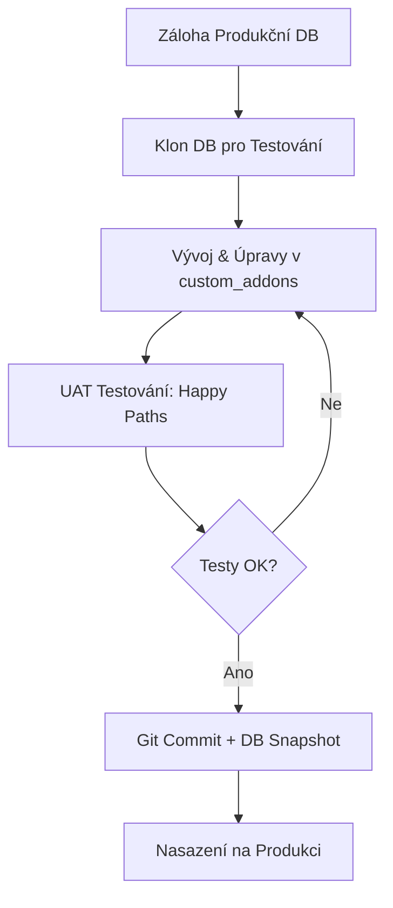

# Odoo Docker Sandbox 🏭💻

Tento repozitář obsahuje mé vývojové a testovací prostředí pro učení Odoo ERP pomocí Dockeru. Slouží jako praktický "můstek" mezi mou dlouholetou praxí v průmyslové výrobě (lakovna) a světem podnikového softwaru.

## 🔧 Požadavky
- **Docker Compose** (izolované prostředí)
- **Python 3.10+** (pro vývoj modulů a lokální skriptování přes Odoo ORM)
- **Min. 4 GB RAM** (Odoo + PostgreSQL vyžadují dostatek paměti pro plynulý chod)
- Volný port `8069` na localhostu

## 📂 Struktura projektu
- `docker-compose.yml` – orchestrace služeb (Odoo + PostgreSQL)
- `config/odoo.conf` – hlavní konfigurační soubor Odoo
- `custom_addons/` – adresář pro vývoj mých vlastních Python modulů a instalaci třetích stran
- `.env.example` – šablona pro bezpečné nastavení hesel a proměnných
- `.gitignore` – ochrana před nechtěným nahráním databázových volumů a citlivých dat

## 🚀 Jak to spustit
1. Zkopírujte soubor s prostředím: `cp .env.example .env` (a doplňte hesla)
2. Spusťte Docker kontejnery: `docker compose up -d`
3. Otevřete v prohlížeči: `http://localhost:8069/web/database/manager`
4. Klikněte na **Create Database**, vyplňte Master Password a případně zaškrtněte "Demo data".

## 🔄 Můj denní vývojový cyklus (SDLC & Odoo Best Practices)
Vývoj ERP není jen o psaní kódu, ale o bezpečné práci s daty. Proto při učení striktně dodržuji tento "bezpečný workflow":

## 🎯 Cíle tohoto projektu
- **UAT & Procesy:** Pochopit a nasimulovat logiku výroby, kusovníků (BOM), správu skladů a pracovních příkazů z pohledu uživatele.
- **Backend & Architektura:** Prozkoumat databázi, ORM vrstvu a vývojářský mód (Developer Mode).
- **Python Vývoj & Automatizace:** Tvorba vlastních modulů v `custom_addons/` a psaní skriptů pro přímou práci s databází přes Odoo ORM (mimo GUI), pro rychlejší iterace a hlubší pochopení architektury.
- **Bezpečná manipulace s daty:** Využití `odoo-bin shell` a Python XML-RPC pro hromadné úpravy, migrace a testování bez rizika poškození business logiky.

## 📌 Milníky (Logbook)
- [x] Úspěšné nasazení Odoo a PostgreSQL přes Docker na Pop!_OS
- [x] Základní konfigurace `docker-compose` a vytvoření testovací DB
- [ ] Zvládnutí Database Manageru (klonování a zálohy DB)
- [ ] Instalace a UAT testování modulů Výroba a Sklady
- [ ] Vytvoření prvního vlastního modulu v `custom_addons`
- [ ] Napsání a otestování Python ORM skriptu pro hromadnou úpravu dat

## 🛠️ FAQ / Troubleshooting
- **Permission denied u custom modulů:** Docker kontejner Odoo běží pod uživatelem `odoo` (UID 101). Pokud lokální systém odmítá zápis/čtení, upravte práva: `sudo chown -R 101:101 custom_addons/`
- **Obsazený port:** Pokud Odoo nestartuje, ověřte, zda port 8069 neblokuje jiná služba: `sudo lsof -i :8069`
- **Rychlé skriptování nad DB:** Místo přímého SQL použijte vestavěný Python shell:  
  `docker exec -it <odoo_container> odoo-bin shell -c /etc/odoo/odoo.conf -d vase_db`  
  Umožňuje bezpečné ORM operace (`env['model'].search()`, `.create()`, `.write()`) s respektováním constraints a computed fields.

> ⚠️ **Poznámka:** Toto prostředí není určeno pro produkční nasazení. Jedná se o osobní studijní laboratoř a simulátor reálných IT procesů.
